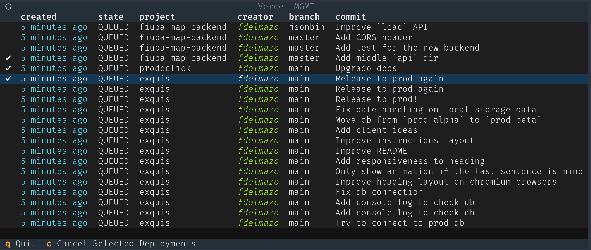

# vercel-mgmt

Cancel multiple builds right from the terminal

```
uvx vercel-mgmt -t <bearer_token> -tid <team_id>
```



Set `VI_MODE=True` for vim navigation (`j`/`k` to move, `g`/`G` for top/bottom).

```
VI_MODE=True uvx vercel-mgmt -t <bearer_token> -tid <team_id>
```

```
## DEBUGGING
# terminal 1
uv run textual console -x SYSTEM -x EVENT -x DEBUG -x INFO -x WORKER
# terminal 2
uv run textual run --dev ./src/vercel_mgmt/mgmt.py -t <bearer_token> -tid <team_id>
```

```
## Updating
uv lock
uv build
uv publish
```
